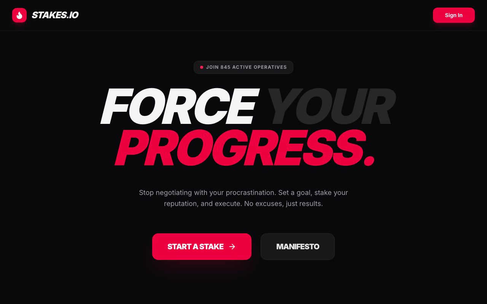
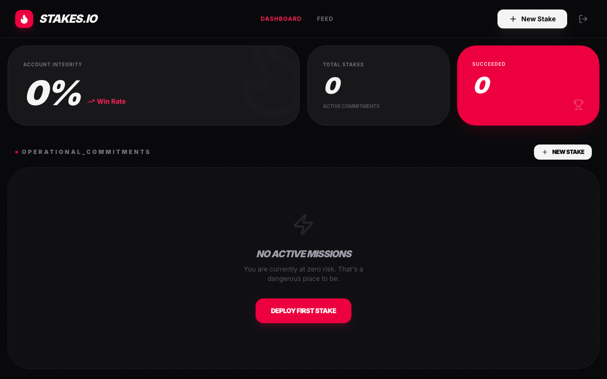
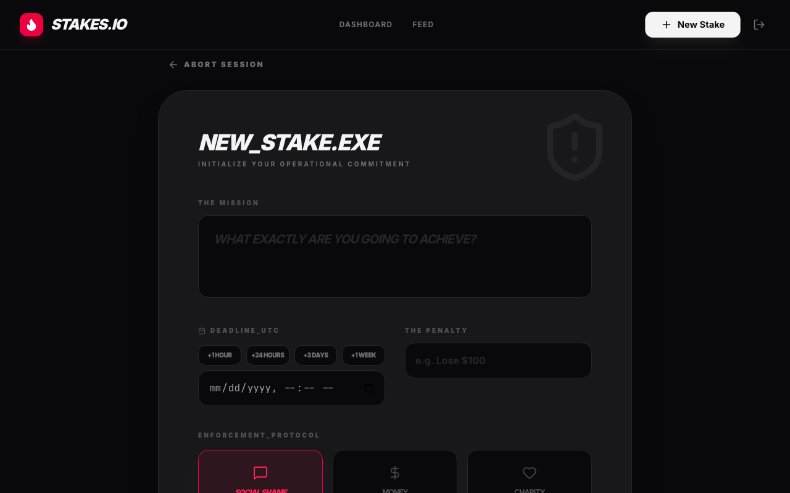
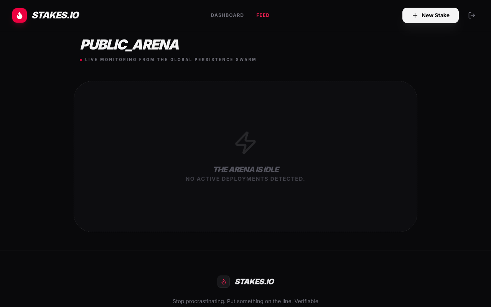

# Stakes.io
## Try it out!
Live demo is available here: [https://stakes-io-598464211339.us-west2.run.app](https://stakes-io-598464211339.us-west2.run.app)


A high-stakes accountability platform that forces execution by putting your reputation (or money) on the line.


## Test Credentials
To try out the application, you can use the following test account:
- **Email:** `test@test.com`
- **Password:** `p@$$w0rd`

## Walkthrough

### 1. Landing Page


### 2. Dashboard


### 3. Create a Stake


### 4. Public Feed


## Productivity Value
When intrinsic motivation fails, external consequences are required. Stakes.io is built for high-performers who need strict accountability. By creating a public "Stake," you commit to a goal with a verifiable deadline and consequence. The public feed ensures social pressure, turning procrastination into an unacceptable outcome.

## How to Run & Test
This project uses Vite and requires Node.js.

1. Install dependencies:
   ```bash
   npm install
   ```
2. Start the development server:
   ```bash
   npm run dev
   ```
3. Explore the dashboard and the public feed of active stakes to understand the accountability mechanics.
